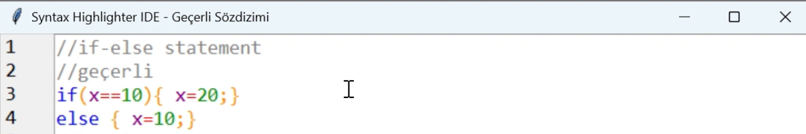

# Real-Time Syntax Highlighter IDE

Bu proje, basit bir programlama dili için **sözdizimi renklendirme (syntax highlighting)** ve **sözdizimi denetimi (syntax checking)** özelliklerine sahip, Python ile geliştirilmiş bir IDE'dir. Bu uygulama; kullanıcının IDE içerisine yazdığı kodları renkli sözdizimi vurgulaması ile daha rahat okumasını sağlarken aynı zamanda gerçek zamanlı sözdizimi denetimi ile hatalı ifadeleri satır bazında tespit eder ve ilgili satır arka planla vurgulanır. 

Proje, Python dili ve Tkinter grafik arayüz kütüphanesi kullanılarak oluşturulmuştur.

Proje videosunu izlemek için [buraya tıkla](https://www.youtube.com/watch?v=568QkIR69jE)  
Projenin makalesini okumak için [buraya tıkla](https://medium.com/@selinnnn14/basit-bir-derleyici-%C3%B6n-ucu-front-end-geli%C5%9Ftirdim-lexical-s%C3%B6zdizim-analizi-ve-syntax-aa41537b9cf1)

---

## Proje Özeti

Bu projede geliştirilen sistem üç ana bileşenden oluşmaktadır:

- **Lexer (tokenizer)**: Kullanıcının girdiği metni anlamlı küçük parçalara (tokenlara) böler.
- **Parser**: Bu token'ları tanımlı kurallara göre kontrol ederek sözdizimi hatalarını tespit eder.
- **IDE Arayüzü**: Gerçek zamanlı kod kontrolü, renkli gösterim ve satır numaralandırması gibi görsel destekler sağlar.

**Desteklenen yapılar:**
- `if`, `else`, `while`, `return` gibi kontrol yapıları
- Değişken atamaları
- `{}` blokları
- Tek satırlık yorumlar (`// yorum`)
- Sayılar, operatörler ve tanımlayıcılar

---

## Özellikler

- Anahtar kelimeleri tanır ve renklendirir
- Tanımlayıcılar, sayılar, operatörler ve ayraçlar için farklı renklendirmeler içerir
- Tek satırlık yorumları (`// yorum`) tanır ve gri renkle gösterir
- Gerçek zamanlı sözdizimi kontrolü içerir
- Hatalı satır arka planla işaretlenir (pembe ton)
- Satır numaralandırma desteği
- Basit token tabanlı lexer
- Kurallı parser ile denetim

---

## Ekran Görüntüleri

### Geçerli kod örnekleri
Doğru şekilde yazılmış kodlar başarıyla analiz edilir ve başlık "Geçerli Sözdizimi" olarak güncellenir.
#### Atama örneği

#### İfade örneği

#### IF-ELSE örneği

#### WHILE örneği

#### RETURN örneği

#### Süslü Parantez örneği

#### Karmaşık örnek

### Hatalı kod örnekleri
Yanlış yazılmış kodlar anlık olarak analiz edilir ve arkaplanla renklendirilerek vurgulanır. Başlık "Hatalı Sözdizimi" olarak güncellenir.
#### Atama örneği

#### İfade örneği

#### IF-ELSE örneği

#### WHILE örneği

#### RETURN örneği

#### Süslü Parantez örneği

---

